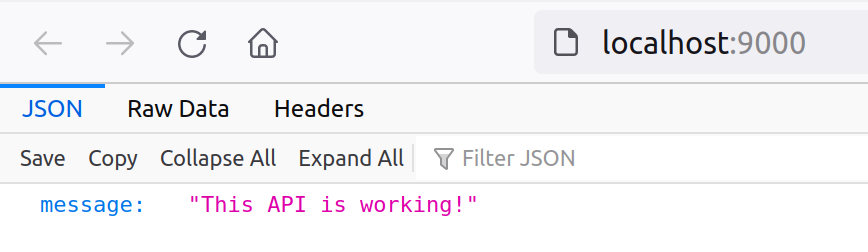

# Dockerized Node app example

1. [Install Docker](https://docs.docker.com/get-docker/)
2. Clone this repo to your local computer
3. Navigate to the folder you clone the repo to
4. Run `docker-compose up --build`
5. Verify that the app is working by navigating to `http://localhost:9000`

If you modify the message on line 7 of `app/index.js`, you should see the change reflected in the response if you refresh.

Congratulations, you are serving a working Express API from your computer that will work whether or not you have Node installed!
